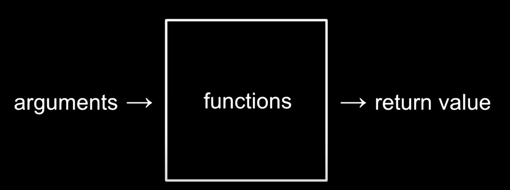

# Linguagem C

A linguagem **C** é uma das linguagens mais utilizadas do mundo e será a linguagem utilizada nesse curso, mas primeiro vamos entender o que são compiladores.

## Compilador

Ao escrevermos um código em **C** na verdade estamos escrevendo um código em uma linguagem próxima da liguagem humana, mas nosso computador não tem a capacidade de compreender esse código, então para que possamos executar-lo precisaremos compilar nosso código, ou seja, converter o código para a linguagem que o nosso computador compreende que seria o **binário**.
Veja abaixo:

***hello.c***

    #include <stdio.h>

    int main(void)
    {
        // Equivalente ao Say em scratch, exibe mensagem com formatação
        printf("Hello, world");
    }

***terminal***

    # Compilando o arquivo
    make hello

    # Executando o arquivo compilado(binário) e já compreensivel para o computador
    ./hello

Agora vamos ver mais sobre funções que são os nosso *verbos* em programação.

## Funções

Na imagem abaixo podemos ver uma simples representação do que seria uma **Função**, uma função recebe argumentos e retorna um valor

